# GIGABYTE H470I AORUS PRO AX Hackintosh

This repository is about hackintosh on **GIGABYTE H470I AORUS PRO AX**. For now, all the hardware is working as expected, it's ready for daily usage and I will continue to follow the updates of OpenCore and macOS.

Anyone who has the same board can use my EFI directly. The source EFI folder uses debug version of OpenCore, mainly used for installation and testing. It’s recommended to use the release version for daily usage, you can replace it yourself or just download my release. Either way, don’t forget to edit the `EFI/OC/config.plist` file, you should generate your own SMBIOS info by following the [Comet Lake Config Guide #PlatformInfo](https://dortania.github.io/OpenCore-Install-Guide/config.plist/comet-lake.html).

Highly recommended reading the whole [OpenCore Install Guide](https://dortania.github.io/OpenCore-Install-Guide/) before you start.

## Hardware

* Motherboard: GIGABYTE H470I AORUS PRO AX
 * Ethernet: Intel I219-V 1.0Gbit
 * Ethernet: Intel I225-V 2.5Gbit
 * Wi-Fi/BT: Intel AX201(onboard) / BCM94360CS(M.2 Adapter)
 * Audio: Realtek ALC1220-VB
* CPU: Intel i9-10900t(es) / 10900
* GPU: Intel UHD630 / AMD Radeon R9 Nano
* RAM: Kingston Fury HyperX DDR4 2666 32GB(16G×2)

## Software

* Bootloader: OpenCore-0.7.4-RELEASE
* OS: macOS Big Sur 11.6 (20G165 / 2021-09-14 / iMac20,2)

## What's working

- [x] Intel UHD630 (iGPU)
- [x] AMD Radeon R9 Nano (dGPU)
- [x] Audio Realtek ALC1220
- [x] Intel I219-V 1.0Gb Ethernet
- [x] Intel I225-V 2.5Gb Ethernet
- [x] Wi-Fi/BT Onboard
- [x] USB
- [x] Restart/Shutdown
- [x] Sleep/Wake
- [x] Power Management (Native support)

## Details

### GPU

#### AMD Radeon R9 Nano

Native support, no additional configuration.

### Audio

Working by:

* AppleALC.kext
* layout-id=7

DeviceProperties:

```xml
<key>PciRoot(0x0)/Pci(0x1f,0x3)</key>
<dict>
    <key>layout-id</key>
    <integer>7</integer>
</dict>
```

### Ethernet

Working by:

* IntelMausi.kext
* FakePCIID.kext
* FakePCIID_Intel_I225-V.kext

### Wi-Fi/BT

Working by:

* AirportItlwm.kext
* IntelBluetoothFirmware.kext
* IntelBluetoothInjector.kext

### BIOS

> Version: F21

#### Disable

* Fast Boot
* VT-d
* CSM
* Intel SGX
* CFG Lock

#### Enable

* VT-x (no option in BIOS, it's enabled by default)
* Above 4G decoding
* EHCI/XHCI Hand-off
* OS type: Windows UEFI Mode (Clear Secure Boot Keys or choose `Other` type)

### EFI

#### SSDTs

Compiled by following the [Dortania's ACPI Guide](https://dortania.github.io/Getting-Started-With-ACPI/), the `.dls` SSDT files can be found in SSDTS folder.

* SSDT-AWAC.aml
* SSDT-EC-USBX-DESKTOP.aml
* SSDT-PLUG-DRTNIA.aml

#### Kexts

All kexts with a version tag are downloaded from original repositories.

* VirtualSMC.kext `1.2.7`
* Lilu.kext `1.5.6`
* WhateverGreen.kext `1.5.4`
* AppleALC.kext `1.6.5`
* AirportItlwm.kext `2.1.0`
* IntelBluetoothFirmware.kext `2.0.1`
* IntelBluetoothInjector.kext `2.0.1`
* VirtualSMC.kext `1.2.7`
* IntelMausi.kext `1.0.7`

## Misc

### Installation

The installation guide in the [OpenCore Install Guide](https://dortania.github.io/OpenCore-Install-Guide/) are quite clear and easy, so there will be no detailed installation tutorials here. Give it some patience and you can build your own EFI.

### Tools

* Generating SMBIOS: [GenSMBIOS](https://github.com/corpnewt/GenSMBIOS)
* Compiling SSDT: [MaciASL](https://github.com/acidanthera/MaciASL)
* Mounting EFI system partition: [MountEFI](https://github.com/corpnewt/MountEFI)
* Editing plist file: [PropereTree](https://github.com/corpnewt/ProperTree)
* Dumping DSDT: [SSDTTime](https://github.com/corpnewt/SSDTTime)
* Toolbox: [Hackintool](https://github.com/headkaze/Hackintool)
* OpenCore Configurator: [OpenCore Configurator](https://mackie100projects.altervista.org)

### Screenshots

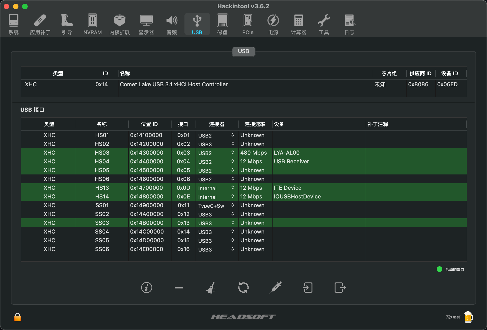
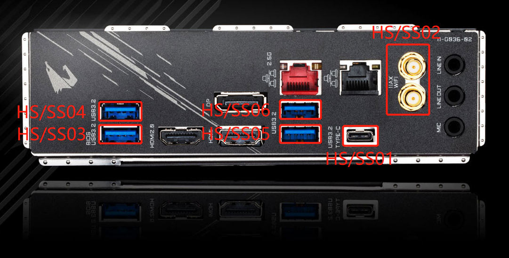
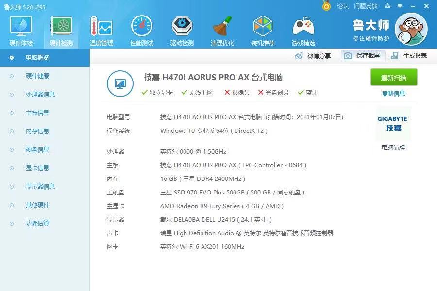
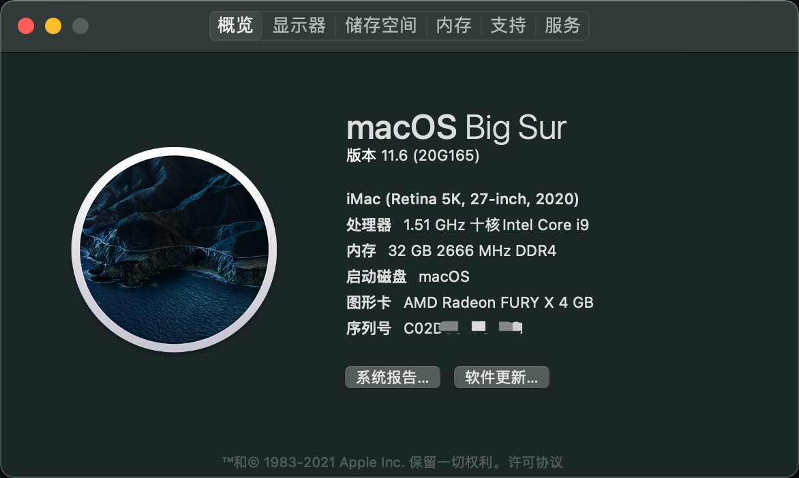
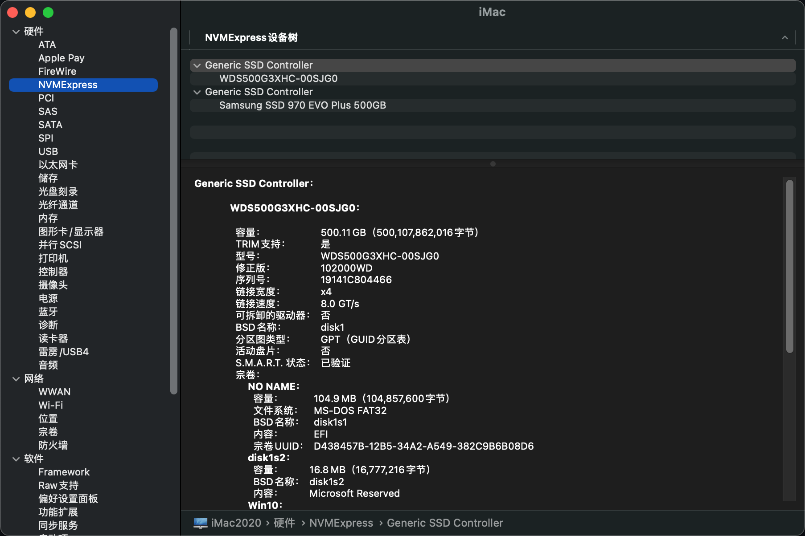
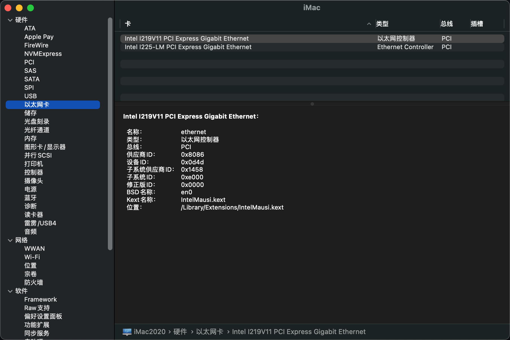
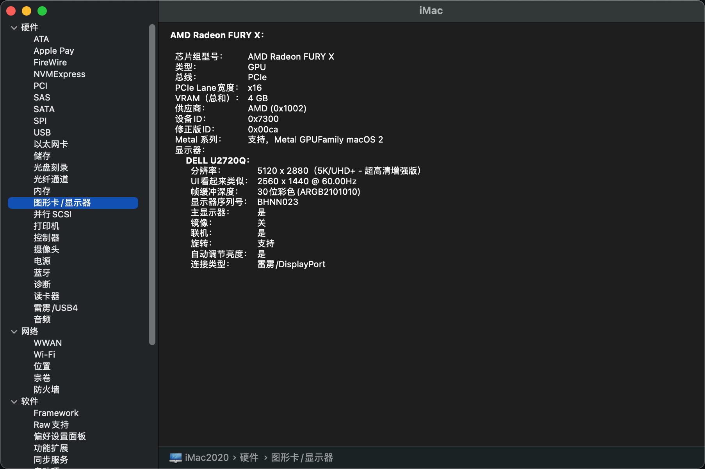
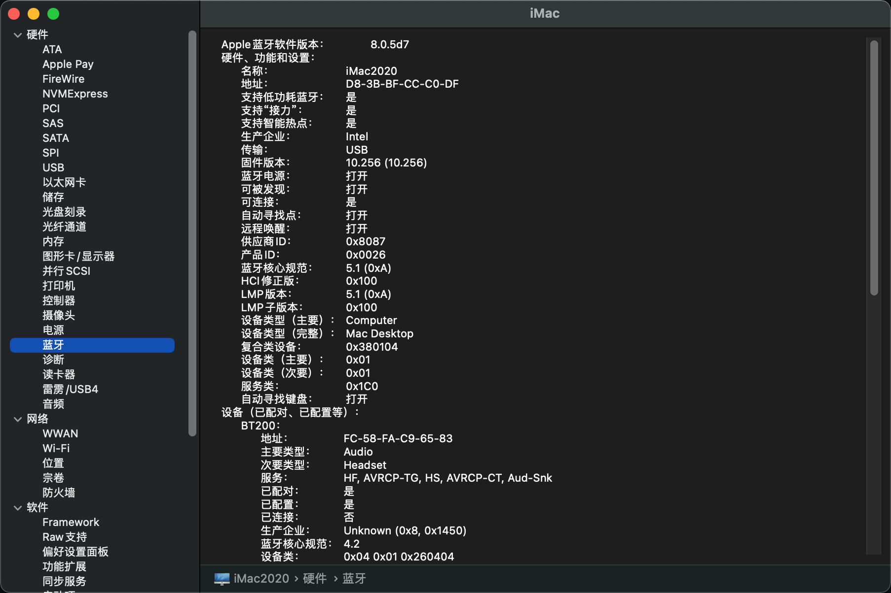
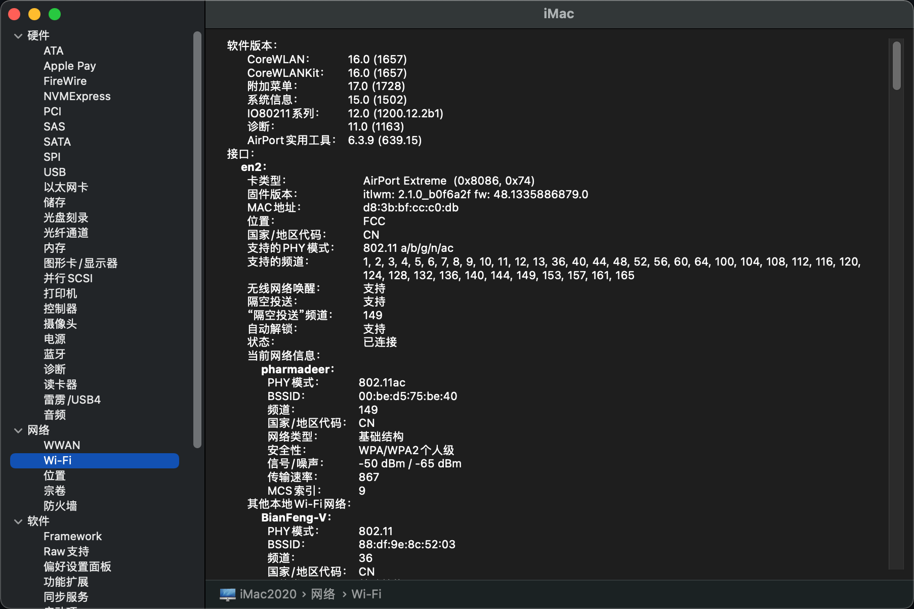
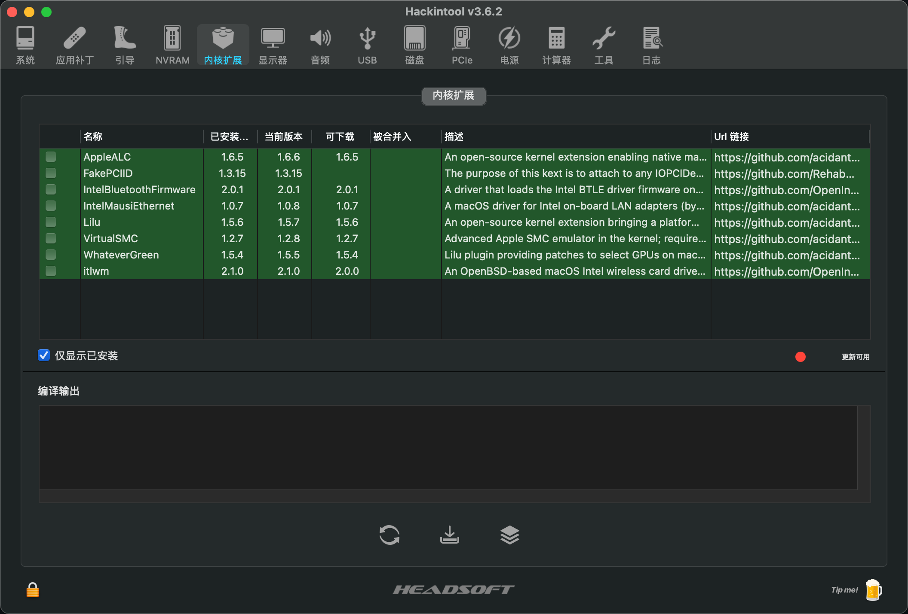
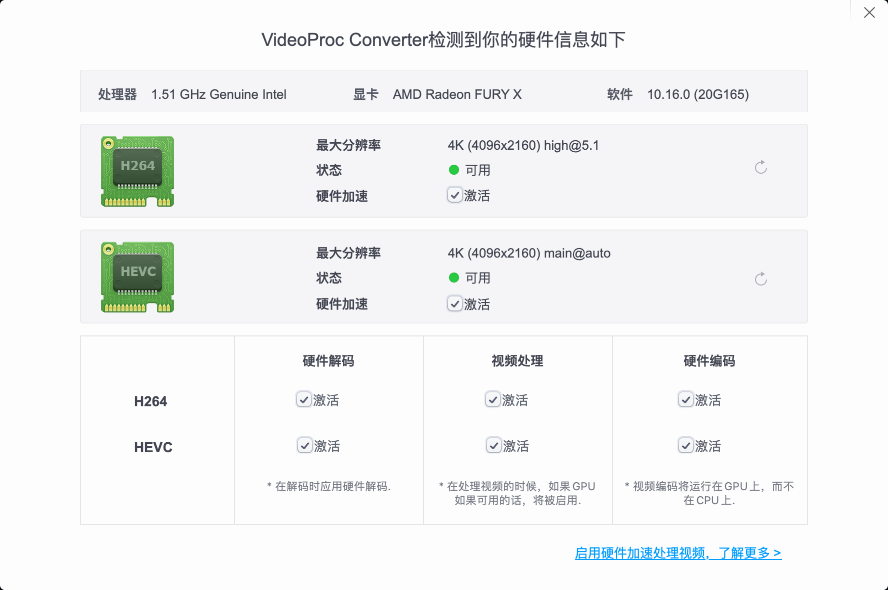
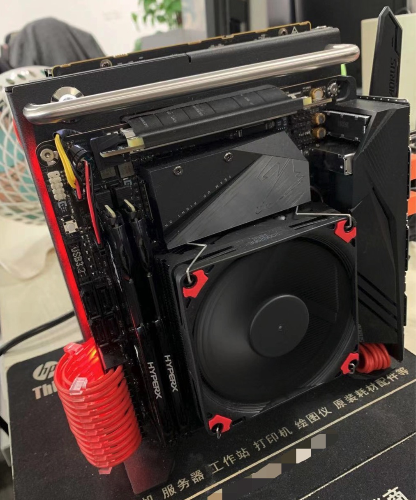

## Credits

* [OpenCorePkg](https://github.com/acidanthera/OpenCorePkg)
* [OpenCore Install Guide](https://dortania.github.io/OpenCore-Install-Guide/)
